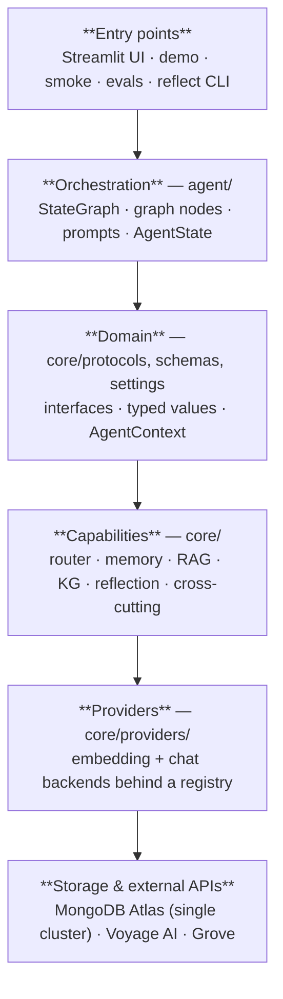

# Architecture

A LangGraph supply-chain assistant that runs entirely on **one MongoDB
Atlas cluster**. The same cluster handles RAG, all three long-term
memory types, short-term chat checkpoints, a structured knowledge
graph, and the action-side `booking_drafts`. Model backends are
pluggable, responses stream token-by-token with TTFT instrumentation,
each node is wrapped in an OpenTelemetry span, and an eval suite
guards against regressions.

## Layered view

Each layer depends only on the layer directly below it. Higher layers
never reach past their immediate neighbour — graph nodes talk to
capability protocols, capabilities talk to providers, providers talk
to storage and external APIs.

## Layer responsibilities

| Layer | Modules | What it does |
|---|---|---|
| **Entry points** | `app.py`, `tools/*.py`, `evals/runner.py` | UI, one-turn demo, smoke test, eval runner, consolidation CLI. |
| **Orchestration** | `agent/graph.py`, `agent/nodes.py`, `agent/prompts.py`, `agent/memory.py` | LangGraph topology (router → parallel retrievers → streamed response → validate_citations → plan_action → execute_action → save), per-turn state, the shared `MongoClient`, and the `booking_drafts` collection. Nodes are thin — capability logic lives one layer down. |
| **Domain** | `core/protocols.py`, `core/schemas.py`, `core/settings.py` | Interfaces every capability and provider implements, the typed objects passed between nodes (incl. `BookingProposal`), and the env-loaded settings + per-turn `AgentContext` (with `correlation_id`). |
| **Capabilities** | `core/router.py`, `core/memory/`, `core/rag/`, `core/kg/`, `core/memory/reflector.py`, `core/citations.py`, `core/latency.py`, `core/resilience.py`, `core/observability.py` | Concrete implementations of the domain protocols: intent router, three LTM classes, RAG, KG, reflection pass, per-sentence citation matcher, plus per-node timing, OTel spans, and per-branch failure isolation. |
| **Providers** | `core/providers/` | Pluggable embedding and chat backends behind `EmbeddingProvider` / `ChatProvider`. Vendor SDK imports live only here. |
| **Storage** | `db/indexes.py`, `data/seed_*.py`, Atlas (`by_genai`) | One cluster: short-term memory, three LTMs, RAG corpus, KG, booking drafts, registry. Vector indexes for the searchable collections, b-tree indexes for the KG joins. A startup preflight (`_assert_vector_index_dims`) checks each vector index matches the active embedding provider. |
| **External APIs** | Voyage AI, Grove gateway | Reached only through the provider classes. |

## Component view

The same layers expanded to show each component and the runtime calls
between them. Read top-down: a user message enters at the top, results
flow back up; the only outbound network is from the providers layer.

```mermaid
flowchart TB
    subgraph UI["Entry points"]
        ST["app.py — Streamlit UI"]
        DEMO["tools/demo.py — one-turn demo"]
        SMK["tools/smoke_turn.py — 3-turn smoke"]
        EV["evals/runner.py — eval suite"]
        RF["tools/reflect.py — consolidation"]
    end

    subgraph ORCH["Orchestration — agent/"]
        GRAPH["graph.py — StateGraph (with interrupt-aware checkpointer)"]
        NODES["nodes.py — classify_intent · 5 retrievers · generate_response (streamed) · validate_citations · plan_action · execute_action · save_memory"]
        PROMPTS["prompts.py — system + extraction + action-planning + consolidation"]
        STATE["AgentState — messages, routing, *_hits, action_plan, booking_draft, citations, latency_ms (incl. llm_ttft_ms), usage (tokens_in/out · cost_usd), degraded"]
    end

    subgraph DOM["Domain — core/"]
        PROTO["protocols.py — interfaces"]
        SCHEMA["schemas.py — typed values"]
        SETT["settings.py — Settings + AgentContext"]
    end

    subgraph CAP["Capabilities — core/"]
        ROUTER["router.py — heuristic → LLM"]
        MEM["memory/ — semantic · episodic · procedural<br/>dedup on write · tombstone on read · vector-dim preflight"]
        REFL["memory/reflector.py — cluster + canonicalize"]
        RAG["rag/mongo.py — $vectorSearch"]
        KG["kg/ — $graphLookup + regex entity extractor"]
        XCUT["latency.py @timed · resilience.py @safe_retrieve · observability.py OTel spans"]
    end

    subgraph PROV["Providers — core/providers/"]
        REG["registry.py — dispatch by env"]
        EMB["embeddings/voyage.py"]
        CHAT["chat/grove.py"]
    end

    subgraph DATA["MongoDB Atlas — db: by_genai"]
        direction LR
        CKP[("checkpoints")]
        SEM[("agent_memories")]
        EPI[("agent_episodes")]
        PROC[("agent_procedures")]
        CORP[("knowledge_corpus")]
        KGC[("kg_carriers · kg_lanes<br/>kg_slas · kg_serves")]
        DRAFTS[("booking_drafts")]
        REGC[("agent_registry")]
    end

    subgraph EXT["External APIs"]
        VOY["Voyage AI"]
        GRV["Grove gateway"]
        OTEL["OTLP collector<br/>(optional, OTEL_ENABLED=1)"]
    end

    ST --> GRAPH
    DEMO --> GRAPH
    SMK --> GRAPH
    EV --> CAP
    RF --> REFL

    GRAPH --> NODES
    NODES --> STATE
    NODES --> PROMPTS
    NODES --> ROUTER
    NODES --> MEM
    NODES --> RAG
    NODES --> KG
    NODES --> CHAT

    ROUTER -.implements.-> PROTO
    MEM -.implements.-> PROTO
    RAG -.implements.-> PROTO
    KG -.implements.-> PROTO
    REFL -.implements.-> PROTO
    NODES -.uses.-> SCHEMA
    NODES -.uses.-> SETT

    ROUTER --> CHAT
    MEM --> EMB
    RAG --> EMB
    REFL --> MEM
    REFL --> CHAT
    REG --> EMB
    REG --> CHAT
    MEM -.- XCUT
    RAG -.- XCUT
    KG -.- XCUT

    MEM --> SEM
    MEM --> EPI
    MEM --> PROC
    RAG --> CORP
    KG --> KGC
    NODES --> DRAFTS
    GRAPH --> CKP
    GRAPH --> REGC
    EMB --> VOY
    CHAT --> GRV
    XCUT --> OTEL
```

## Request flow (one user turn)

1. **Route.** The chained router picks an intent label and a subset of
   retrievers to run. A fresh `correlation_id` is minted into
   `AgentContext` so every span and `booking_draft` row written for the
   turn is joinable in OTel.
2. **Fan out.** The selected retrievers run in parallel. Each one is
   timed (`@timed` opens an OTel span) and isolated by `@safe_retrieve`,
   so a single failure doesn't take the turn down.
3. **Generate (streamed).** The chat provider is called with a system
   prompt assembled by `build_system_prompt(_branch_contexts(state))`:
   the operating-rules preamble is constant, then only the per-branch
   sections (`ltm`, `episodes`, `procedures`, `rag`, `kg`) whose branch
   was selected by `plan.branches` (or `routing.branches`) **and** whose
   payload is non-empty are appended in canonical order. Skipped or
   empty branches are dropped header-and-content so the Writer never
   pays tokens for stubs. Token deltas are pushed to LangGraph's
   custom-channel `get_stream_writer` as they arrive; the first
   non-empty delta records `llm_ttft_ms`. The Streamlit UI renders the
   partial reply live.
4. **Validate citations.** `validate_citations` does two things in one
   pass, no extra LLM call: (a) scans the reply for any retrieved RAG
   `source` (or KG `source_doc`) and appends `"citations_missing"` to
   `state['degraded']` when nothing matches — surfaced as a yellow
   banner in the UI without blocking the rest of the graph; (b) runs
   `core.citations.match_citations` to bind each reply sentence to its
   strongest-supporting chunk by lexical-token overlap and writes the
   list of `CitationSpan` records to `state['citations']`. The
   Streamlit reply renderer turns those spans into inline ``
   markers (numbered by unique source, with a native-browser tooltip
   showing the source + evidence preview) and a "Sources" expander.
5. **Plan.** `plan_action` runs `chat.invoke_typed(..., BookingProposal)`
   against the agent reply and produces a typed proposal (or
   `action_type="none"`).
6. **Execute.** `execute_action` upserts the proposal into
   `booking_drafts` keyed by a deterministic `draft_id`. If
   `requires_approval` is true (cost > `$10,000` or the reply contains
   `[REQUIRES HUMAN APPROVAL]`), the node calls `interrupt(payload)` —
   LangGraph captures the request in `checkpoints`, the Streamlit UI
   renders an inline Approve / Reject card, and a later
   `graph.invoke(Command(resume={"approved": …, "approver": …}))`
   resumes the node from the checkpoint and flips the row to `executed`
   or `rejected`.
7. **Save.** A single structured-output prompt extracts facts + episode
   in one chat call. Both are written through the dedup-aware `put`
   (bumps a counter if a near-duplicate already exists).
8. **Checkpoint.** LangGraph's `MongoDBSaver` persists the turn's
   state to `checkpoints`, keyed by `thread_id`. The same checkpoint
   trail powers two recovery flows: HIL approvals
   (`Command(resume=…)`) and per-node failure retries (see below).
9. **Retry on failure.** Any degraded marker that maps to a specific
   node — `structured_failed:<node>`, `safe_retrieve` exceptions, or
   `reflection_failed` — produces a **🔄 Retry `<node>`** button in the
   Streamlit turn card. The button replays from the pre-node checkpoint
   located by `find_retry_checkpoint`, which walks
   `graph.get_state_history(config)` newest-first for the matching
   `next` tuple, then streams the graph forward via
   `graph.stream(None, anchor_config, …)` and replaces the turn in
   place. Informational markers (`chat_fallback:*`, `structured_retry:*`,
   `citations_missing`, `cost_extracted_via_fallback`, `draft_*`) are
   not retryable and never surface a button.

Out-of-band: `python -m tools.reflect` consolidates near-duplicate
memories into canonical rows; `python -m evals.runner --mode live
--against evals/baseline.json` re-scores the four suites (intent, RAG
recall, KG row-match, action planning) and exits non-zero if any score
drops beyond `--score-tolerance`; `--mode latency --against
evals/latency_baseline.json` does the same for `ttft_p95` / `llm_p95`
with a configurable `--latency-factor`.

## Scoping model

| Scope key | Used by | Why |
|---|---|---|
| `(realm_id, user_id)` | `agent_memories`, `agent_episodes`, `checkpoints`, `booking_drafts` | Per-user state survives new chats but stays tenant-isolated. |
| `(realm_id, agent_id)` | `agent_procedures`, `kg_*` | Rules and the KG belong to the tenant's deployment of the agent, not to an end user. |
| `thread_id` | `checkpoints` only | "New Session" resets the chat without losing LTM, KG, or `booking_drafts` history. |
| `correlation_id` | OTel spans, `booking_drafts.correlation_id`, deterministic `draft_id` seed | One id per turn ties together every span, every persisted side effect, and any later resume after an interrupt. |

`AgentContext` carries these ids through every node.

## Swap points

- **Vector DB.** Implement the relevant memory / RAG / KG protocol
  against another backend. `agent/` is unchanged.
- **Embedding or chat model.** Add a new class under
  `core/providers/`, register it, and set the matching env var.
- **Router.** Implement `IntentRouter.route` and plug it into
  `get_intent_router()`.
- **Reflection strategy.** Implement `MemoryReflector.reflect` with a
  different clustering or prompt; the rest of the pipeline doesn't change.
- **Action backend.** `execute_action` writes to `booking_drafts` and
  pauses on `interrupt()`. Swap the persistence (e.g. SAP, TMS) by
  changing only `execute_action`; the prompt, the schema, and the
  approval gate stay the same.
- **Telemetry.** `core.observability` honours the standard OTel env
  vars. Point `OTEL_EXPORTER_OTLP_ENDPOINT` at any collector to capture
  per-node spans with correlation id + tenant/user/agent attributes.
- **Eval datasets.** Drop new `.jsonl` files under `evals/datasets/`.
